# Vmware安装和Windows/Linux虚拟机

  

>BT下载器：https://www.qbittorrent.org/
>
>Windows镜像下载地址：https://next.itellyou.cn/Original
>
>Centos镜像下载地址：http://isoredirect.centos.org/centos/7/isos/x86_64/
>
>VMware Workstation官方地址：https://www.vmware.com/go/getworkstation-win
>
>VMware Workstation Pro激活码:ZF3R0-FHED2-M80TY-8QYGC-NPKYF\ZF3R0-FHED2-M80TY-8QYGC-NPKYF\ZF71R-DMX85-08DQY-8YMNC-PPHV8


  VMware（公司）的`VMware Workstation`是一个搭建虚拟机的软件，作用是能够让你在一台计算机上安装多个操作系统，包括`Linux`系统。安装多个操作系统的作用是为了在后续的测试中更加方便，比如在进行木马免杀时，可以在不同的机器上安装不同的杀软进行测试；在WEB漏洞复现是，可以搭建本机的`LinuxWeb`环境，方便进行测试。


  安装`VMware Workstation PRO` 直接到官方的网址下载最新版本，安装使用默认配置即可：

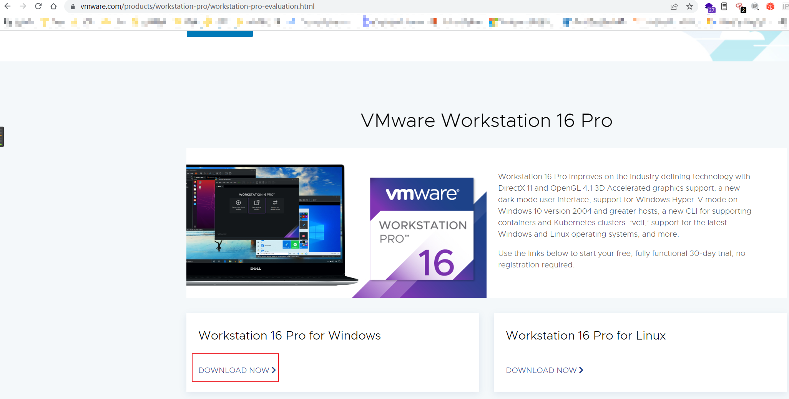


安装完成之后，在帮助中找到：“输入许可证秘钥”。将上方的激活码填入，然后再点击：“关于VMware Workstation”。当许可证为永久时表示激活成功：

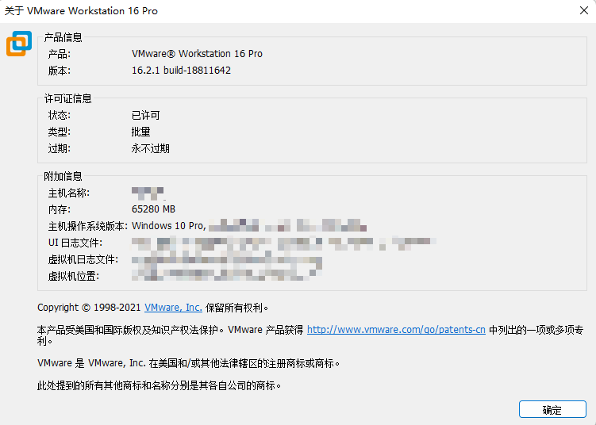


安装好虚拟机软件后，接着下载你所需要的系统镜像，这里推荐的镜像下载网站为：“MSDN”，访问首页进行登录之后就可以获取下载链接：

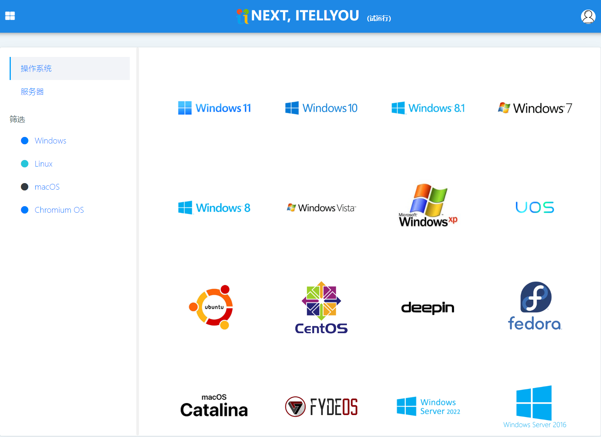


由于下载链接为BT和ed2k，如果你有迅雷会员，可以直接使用迅雷进行下载，没有的话可以使用上面推荐的下载软件进行下载。


## Windows虚拟机安装


  打开 VMware 选择新建虚拟机：

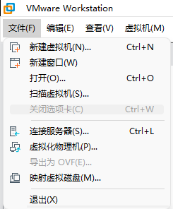


选择高级自定义：

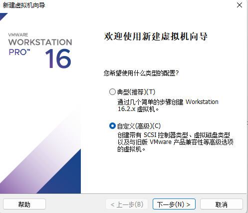


在选择 “安装客户端操作系统时”，选择稍后安装操作系统：

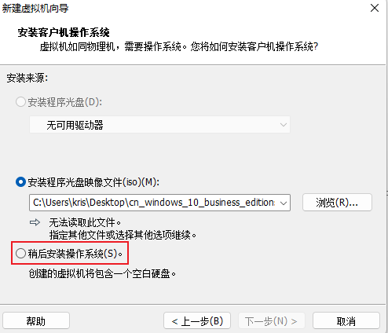


根据你将要安装的镜像进行选择：

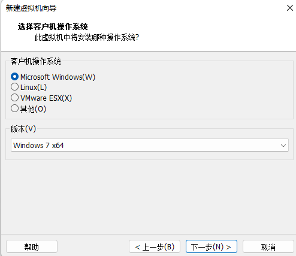


虚拟机名称和安装位置自己选择，虚拟机名字可以修改：

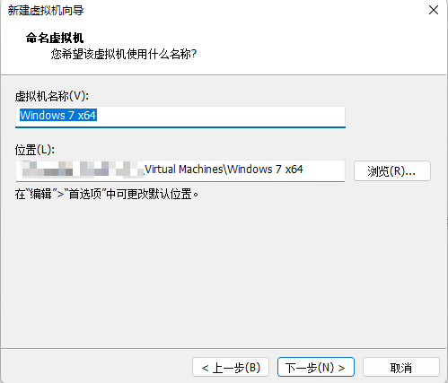


下面是后面的配置信息，可以根据自己时间情况修改：

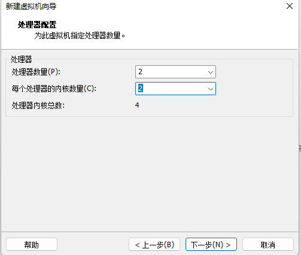

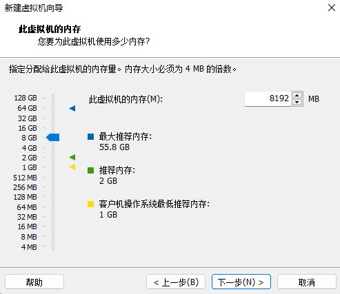

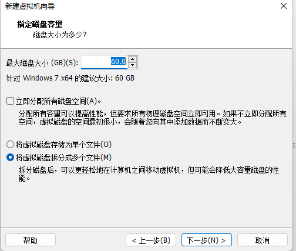


网络配置这个地方需要注意一下，如果是在学校使用校园网的话吗，需要选择NAT模式使用外部物理机的IP地址进行互联网连接，如果直接使用桥接会在路由上申请新的IP，就会让你进行宽带认证；如果不是在校园的话可以直接使用桥接模式：

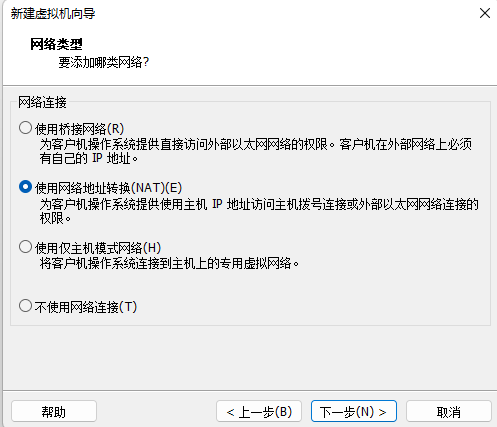


全部配置完成之后就会在控制台出现你创建的主机：

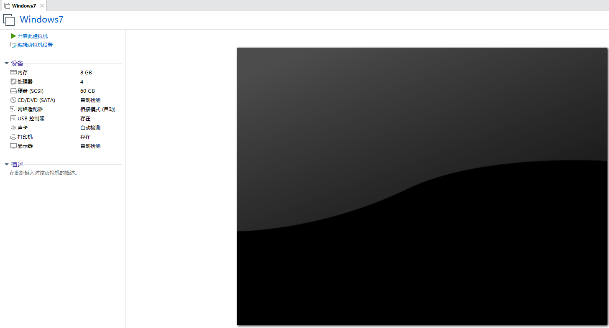


接着配置镜像：点击 “编辑虚拟机设置”，在硬件选项中点击CD/DVD，然后将下载的镜像路径选择：

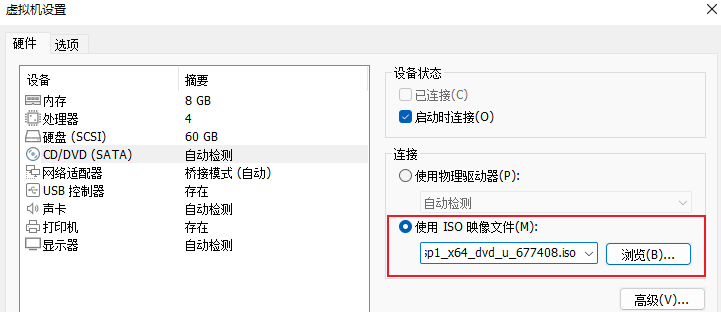


保存之后就可以选择打开虚拟，后续的操作就和正常使用电脑是一样的了。


安装成功后，会出现界面无法全部填充，这是因为没有安装Vmtools：

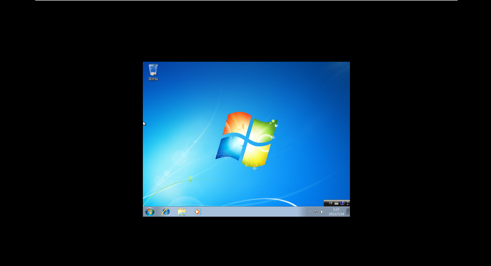


安装重启就不会出现这样的情况：

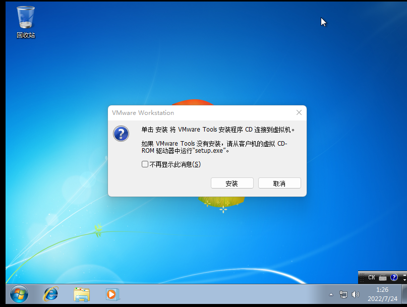


安装VMtools出现下面的情况需要安装补丁：

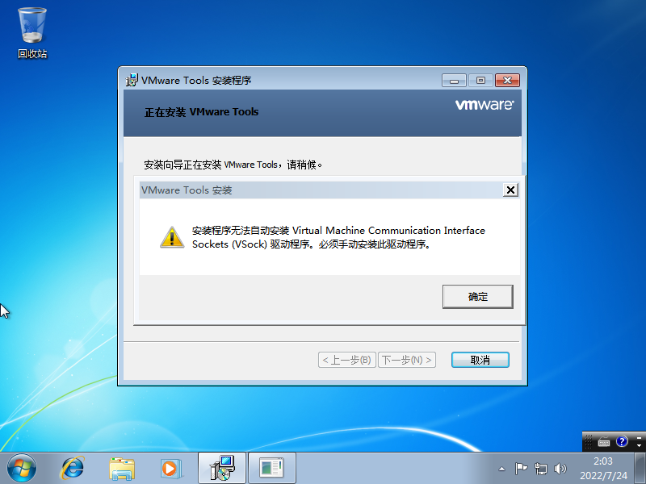


```
https://www.catalog.update.microsoft.com/search.aspx?q=kb4474419
```


下载到本地，由于无法使用VMtools。可以直接在虚拟机访问物理机的SMB服务：

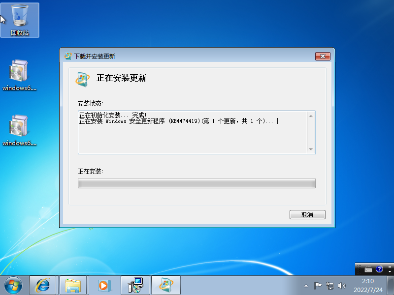


然后安装VMtools就可以全屏：

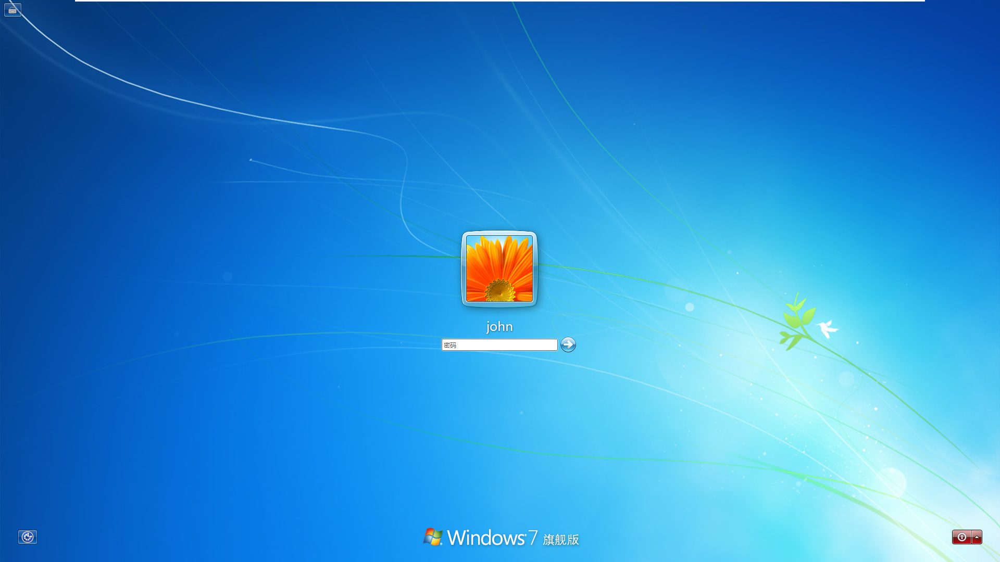


