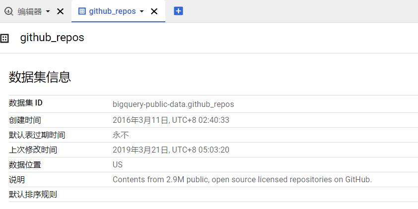

# WebPathFuzz


  WEB目录扫描/爆破是渗透测试比较重要的一环，这个步骤可以帮我们找到很多的页面供我们测试，最常见的就是通过目录爆破找到后台登录页面，然后尝试弱口令测试。

web目录爆破的原理其实很简单，就是通过网络库不断的发送请求包，获取到服务器的响应包，做一个简单的测试，使用`curl`获取 google 的页面：


```bash
curl -L -I -m 10 -o /dev/null -s -w %{http_code} http://www.google.com
```


请求 Google 的响应码为200，表示我们请求的页面是存在的，接着我们在请求url后加上一个随机字符：

```bash
curl -L -I -m 10 -o /dev/null -s -w %{http_code} http://www.google.com/ceshi
```


状态码为404，表示并不存在这个目录/页面，按照这样的逻辑只需要写一个脚本轮流替换域名之后的目录就可以达到爆破的目的，这就是web目录爆破的基本原理。


  根据上面的介绍，目录扫描需要扫描器和目录，一个好的目录扫描工具更多的是需要字典更加优秀，扫描工具本身相对来说并不是最重要的，所以字典的收集就成为了比较重要的一环。


## BigQuery

> https://cloud.google.com/bigquery


  在github上有许多非常成熟的字典项目可以使用，但是我们需要有能够自己制作字典的能力，这里介绍一种字典制作方式，利用 `GoogleBigQUery` 进行字典的制作。

  在制作之前了解一下`BigQery`是什么。

  BigQuery是谷歌推出的一个大数据分析应用，BigQuery 的无服务器架构允许使用 SQL 查询任何你想要获得的信息，数据来源众多，在官方文档中提及到的三个核心的应用为：

1. 存储
2. 分析
3. 管理

这里着重使用分析功能用于字典制作，分析功能能够在几秒内对TB级数据进行处理，几分钟内对PB级数据进行处理，能够从海量的数据中快速获取你想要的信息。可以使用标准SQL语句进行查询。


## 使用


  进入首页可以免费试用：


点击免费试用之后可以进入控制台：


在上方创建了一个临时项目--一个简单的php文件查询语句：

```sql
select
  count(id) as times,
  array_reverse(split(path,"/"))[safe_offset(0)] as filename
 from bigquery-public-data.github_repos.files
 where path like '%.php'
 group by filename
 order by times
 desc limit 20000
```


`bigquery-public-data` 是BigQuery提供的公共数据库信息，在公共数据库中能够查询的数据如下：


可以在下方任意选择数据进行查询，我们的目的是制作字典，所以可以使用 `GitHub` 在 BigQUery 公开的数据中查询：


官方对数据源进行了说明和介绍：

> https://hoffa.medium.com/github-on-bigquery-analyze-all-the-code-b3576fd2b150


文章中明确表示所有 `GitHub` 公开源码（master分支）都可以使用 BigQuery 查询到数据，所以就可以使用提供的库进行查询，查询的表为：

```text
bigquery-public-data.github_repos
```




需要注意的是数据最近更新时间为2019年，按照这个库可以直接创建查询：


由于使用的是免费的额度，每个月只能查询10GB的活跃存储和1TB的已处理查询数据，所以不浪费额度运行。


了解过上面的内容后，按照模板可以查询想要制作的数据库信息，下面查询一个以php结尾的数据，获取到数据可以直接保存数据，保存到本地即可：


对查询的数据进行处理就可以制作字典。
